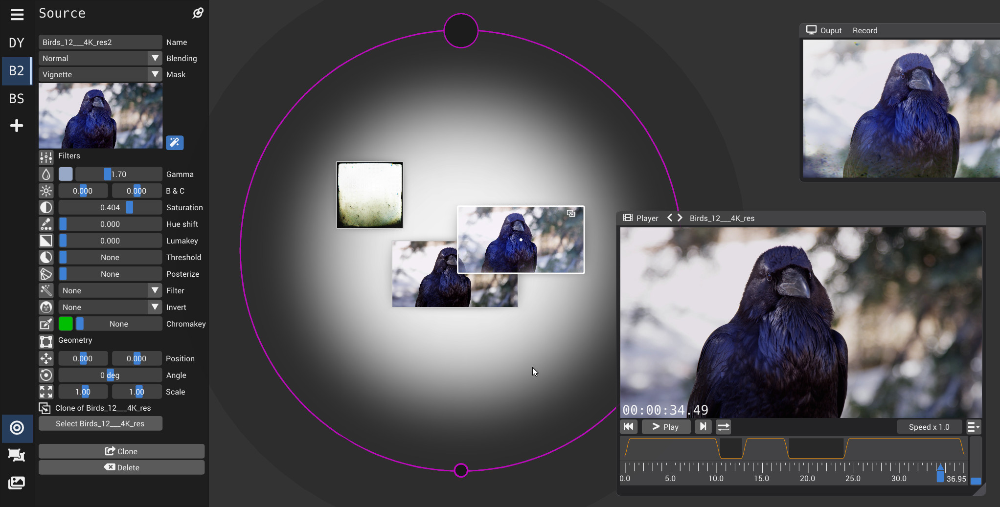

vimix performs **graphical mixing and blending** of several movie clips and
computer generated graphics, with image processing effects in real-time.

Its intuitive and hands-on user interface gives direct control on image opacity and
shape for producing live graphics during concerts and VJ-ing sessions.

The ouput image is typically projected full-screen on an external
monitor or a projector, but can be streamed or recorded live (no audio).

Check the [Graphical User Manual](https://github.com/brunoherbelin/vimix/wiki/User-manual) for more details or this selection of [videos by Jean Detheux](https://vimeo.com/showcase/7871359).

## Install vimix

### Linux

    snap install vimix

### Mac OSX

Download package from [Github Release](https://github.com/brunoherbelin/vimix/releases)

*NB: You'll need to accept the exception in OSX security preference.*

### Windows

*Please consider helping by compiling & providing packages for Windows.*

## About

vimix is free and open source (GPL3).

vimix is the successor of [GLMixer](https://sourceforge.net/projects/glmixer/), benefiting
from these 10 years of refinement of User-Experience design since its [first draft](https://sourceforge.net/p/glmixer/wiki/GLMixer%20History/).

vimix is in its early infancy, open to [features requests and bugs reports](https://github.com/brunoherbelin/vimix/issues).

vimix welcomes contributions and support: check the [wiki](https://github.com/brunoherbelin/vimix/wiki) for more info

[comment]: # (webpage hosted at https://brunoherbelin.github.io/vimix/)
